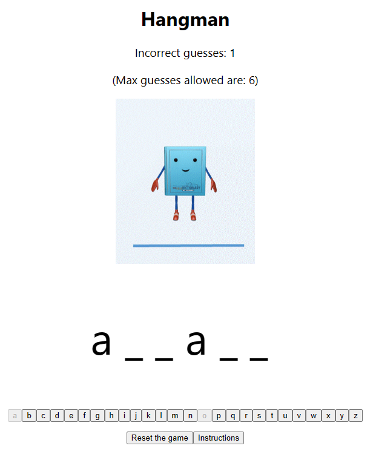

# Hangman Game

This project is a simple Hangman game built with React.

## Installation

To install this project, simply clone this repository and run `npm install` to install the dependencies.

## Usage

To start the development server, run `npm start`. This will start the server at [http://localhost:3000](http://localhost:3000).

## Rules of the Game

There is a help button in the game that explains the rules. Please refer to this.

## Contributing

Contributions to this project are welcome. Please submit a pull request with any changes you would like to contribute.

## License

This project is licensed under the [MIT License](LICENSE).
